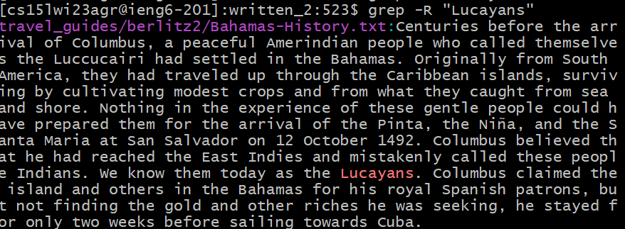
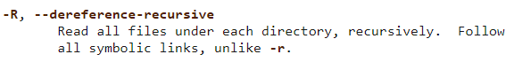

# Lab Report 3: Ruben A Gonzalez
**Researching Commands** : When using the terminal there are several different commmands we can use. Some examples are *less* , *find* , *grep*.
## Using *find* on a directory

In this example, we used find to find every single file inside the directory.
We can also use the command *cd* to takes you back to the root directory of the current drive.
---
## Using *cd* to go to a specific directory.
---

## Using *find >* to make a new file containing everything inside the written_2/ directory.

## Using *grep* Let's you grab specific string.

## Using this *.grep -R "(string)" * allows you to grap any specific String.

---

We can see that the command -R in Linux/UNIX system programming training: 
[grep -R website](https://man7.org/linux/man-pages/man1/grep.1.html)
---

**File and Directory Selection**
---

---
**Example using -R
```
[cs15lwi23agr@ieng6-201]:written_2:550$ ls
non-fiction  travel_guides
[cs15lwi23agr@ieng6-201]:written_2:551$ grep -R "Lucayans"
travel_guides/berlitz2/Bahamas-History.txt:Centuries before the arrival of Columbus, a peaceful Amerindian people who called 
themselves the Luccucairi had settled in the Bahamas. Originally from South America, they had traveled up through the Caribbean
islands, surviving by cultivating modest crops and from what they caught from sea and shore. Nothing in the experience of these 
gentle people could have prepared them for the arrival of the Pinta, the Niña, and the Santa Maria at San Salvador on 12 October 
1492. Columbus believed that he had reached the East Indies and mistakenly called these people Indians. We know them today as the
Lucayans. Columbus claimed the island and others in the Bahamas for his royal Spanish patrons, but not finding the gold and other 
riches he was seeking, he stayed for only two weeks before sailing towards Cuba.

```
---
**Example using -r**
```
[cs15lwi23agr@ieng6-201]:written_2:548$ grep -r "Lucayans"
travel_guides/berlitz2/Bahamas-History.txt:Centuries before the arrival of Columbus, a peaceful Amerindian people who called 
themselves the Luccucairi had settled in the Bahamas. Originally from South America, they had traveled up through the Caribbean 
islands, surviving by cultivating modest crops and from what they caught from sea and shore. Nothing in the experience of these 
gentle people could have prepared them for the arrival of the Pinta, the Niña, and the Santa Maria at San Salvador on 12 October 
1492. Columbus believed that he had reached the East Indies and mistakenly called these people Indians. We know them today as the 
Lucayans. Columbus claimed the island and others in the Bahamas for his royal Spanish patrons, but not finding the gold and other 
riches he was seeking, he stayed for only two weeks before sailing towards Cuba.
```
