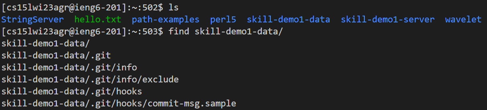
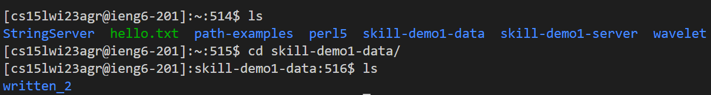
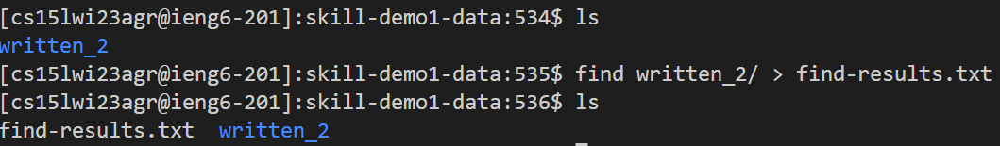
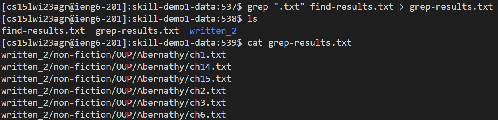

# Lab Report 3: Ruben A Gonzalez
**Researching Commands** : When using the terminal there are several different commmands we can use. Some examples are *less* , *find* , *grep*.
## Using *find* on a directory

In this example, we used find to find every single file inside the directory.
We can also use the command *cd* to takes you back to the root directory of the current drive.
---
## Using *cd* to go to a specific directory.
---

## Using *find >* to make a new file containing everything inside the written_2/ directory.

## Using *grep* Let's you grab specific string.
 

